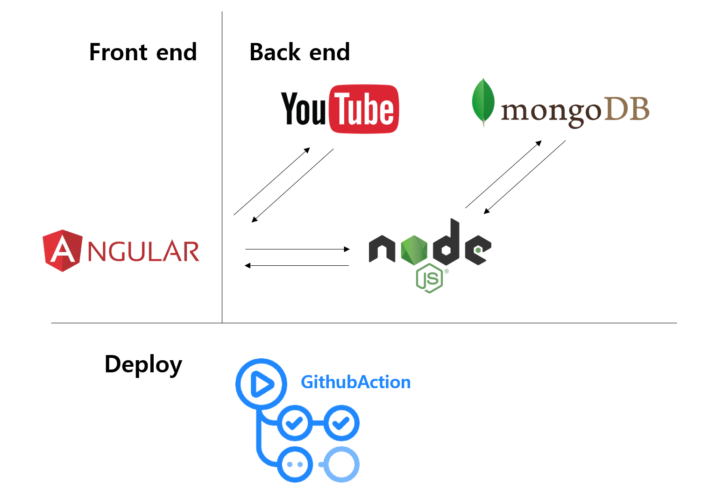

# Subply

프로젝트: Subply (Subtitle Translation Crowdsourcing) </br>
팀명: Angular:p

## 개발 환경

Anuglar CLI: 9.1.7  </br>
Node: 10.15.1 </br>
OS: win32 x64
 
</br>

Angular 패키지 버전

| Package                    | Version |
| -------------------------- | ------- |
| @angular-devkit/architect  | 0.901.7 |
| @angular-devkit/core       | 9.1.7   |
| @angular-devkit/schematics | 9.1.7   |
| @schematics//angular       | 9.1.7   |
| @schematics/update         | 0.901.7 |
| rxjs                       | 6.5.4   |

## 프로젝트 소개

Subply은 Subtitle + reply 을 의미합니다. </br>
Youtube 영상 자막에 댓글을 달아 **대중참여 번역** 작업을 할 수 있는 웹 서비스 입니다.

## 프로젝트 기능

subply 자막 번역, 번역 스크립트 파일 다운로드

## 프로젝트 구조



## 개발하기

아래 명령어를 실행한한 후 http://localhost:4200/ 에 접속하세요.

```
git clone https://github.com/subply/subply.git
cd subply
npm i # NodeJS dependency package install
npm start # Server start
```

<!--

## 기여하기

- [Angular CLI](#Angular-CLI)
# Angular CLI

This project was generated with [Angular CLI](https://github.com/angular/angular-cli) version 7.3.4.

## Development server

Run `ng serve` for a dev server. Navigate to `http://localhost:4200/`. The app will automatically reload if you change any of the source files.

## Code scaffolding

Run `ng generate component component-name` to generate a new component. You can also use `ng generate directive|pipe|service|class|guard|interface|enum|module`.

## Build

Run `ng build` to build the project. The build artifacts will be stored in the `dist/` directory. Use the `--prod` flag for a production build.

## Running unit tests

Run `ng test` to execute the unit tests via [Karma](https://karma-runner.github.io).

## Running end-to-end tests

Run `ng e2e` to execute the end-to-end tests via [Protractor](http://www.protractortest.org/).

## Further help

To get more help on the Angular CLI use `ng help` or go check out the [Angular CLI README](https://github.com/angular/angular-cli/blob/master/README.md). -->
